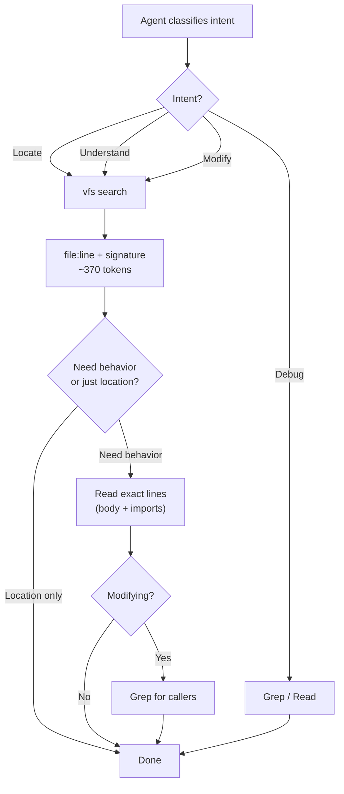

<p align="center">
  
</p>

# vfs

**Virtual Function Signatures** -- extract exported function, class, interface, and type signatures from source code with bodies stripped.

## Table of Contents

- [Why vfs?](#why-vfs)
- [How It Works](#how-it-works)
- [Benchmark](#benchmark)
- [Security & Privacy](#security--privacy)
- [Supported Languages](#supported-languages)
- [Install](#install)
  - [Pre-built binary](#pre-built-binary)
  - [Build from source](#build-from-source)
  - [Docker](#docker)
- [Quick Start](#quick-start)
- [CLI Reference](#cli-reference)
- [Setup for AI Tools](#setup-for-ai-tools)
  - [Step 1: Connect vfs](#step-1-connect-vfs)
  - [Step 2: Define an Agent Rule](#step-2-define-an-agent-rule-required)
- [Contributing](#contributing)
- [Used By](#used-by)
- [License](#license)
- [Star History](#star-history)

## Why vfs?

AI coding agents waste tokens by grepping or reading entire files just to find a function. vfs parses source via AST and tree-sitter, returning only the signatures -- a compact "table of contents" of any codebase.

**60-70% fewer tokens per search.**

It works with any AI coding tool -- Cursor, Claude Code, Antigravity, Windsurf, Cline, Continue, Aider, Copilot, Zed, or your own scripts. No vendor lock-in.

## How It Works



> The agent classifies its intent first. For **Locate**, **Understand**, and **Modify** intents, vfs runs first to get signatures (~370 tokens vs ~26,000 for reading files). Only then does the agent Read exact lines or Grep for callers as needed. For **Debug** intent, Grep goes first since you need to search inside function bodies.

Given a Go project with thousands of lines, asking "where is the login handler?" traditionally means grepping or reading entire files. vfs gives you just the signatures:

```
$ vfs . -f login
internal/handlers/auth.go:23:   func HandleLogin(w http.ResponseWriter, r *http.Request)
internal/services/auth.go:10:   func ValidateToken(token string) (*Claims, error)
internal/middleware/jwt.go:45:  func RequireLogin(next http.Handler) http.Handler
```

Each line tells you the **file**, **line number**, and **full signature** -- no function bodies, no imports, no noise. You (or your AI agent) can then read only the exact lines needed.

This works across 17 languages:

```
$ vfs ./frontend -f auth
src/hooks/useAuth.ts:5:         export function useAuth(): AuthContext
src/components/LoginForm.tsx:12: export const LoginForm: React.FC<LoginFormProps>
src/api/client.py:28:           def authenticate(username: str, password: str) -> Token
```

## Benchmark

Self-benchmark on this repository (pattern `"Extract"`, 4,178 lines of source):

|                 | Read all files | grep       | vfs        |
|-----------------|----------------|------------|------------|
| Output size     | 101.9 KB       | 13.8 KB    | 1.5 KB     |
| Lines           | 4,178          | 148        | 15         |
| Est. tokens     | 26,079         | 3,537      | 373        |

- **vfs saves 98.6% tokens** vs reading all files (26,079 -> 373)
- **vfs saves 89.5% tokens** vs grep (3,537 -> 373)

Run it yourself:

```bash
vfs bench --self                                   # self-test on vfs source
vfs bench -f HandleLogin /path/to/go-project       # benchmark on any project
vfs bench -f Login /path/to/project --show-output  # show actual output
```

## Security & Privacy

> **Local-first by design.** Your source code never leaves your machine.

- **Zero network access** -- all parsing is local via AST and tree-sitter. No outbound connections, ever.
- **No secrets exposure** -- does not read, access, or store API keys, credentials, or environment variables.
- **No data collection** -- no telemetry, no analytics, no tracking.
- **No code storage** -- source is parsed in memory and discarded. Only `~/.vfs/history.jsonl` (scan statistics) is written.
- **Fully offline** -- install once, use forever.

## Supported Languages

| Language        | Extensions                              | Parser      |
|-----------------|-----------------------------------------|-------------|
| Go              | `.go`                                   | `go/ast`    |
| JavaScript      | `.js`, `.mjs`, `.cjs`, `.jsx`           | tree-sitter |
| TypeScript      | `.ts`, `.mts`, `.cts`, `.tsx`           | tree-sitter |
| Python          | `.py`                                   | tree-sitter |
| Rust            | `.rs`                                   | tree-sitter |
| Java            | `.java`                                 | tree-sitter |
| C#              | `.cs`                                   | tree-sitter |
| Dart            | `.dart`                                 | tree-sitter |
| Kotlin          | `.kt`, `.kts`                           | tree-sitter |
| Swift           | `.swift`                                | tree-sitter |
| Ruby            | `.rb`                                   | tree-sitter |
| Solidity        | `.sol`                                  | tree-sitter |
| HCL / Terraform | `.tf`, `.hcl`                           | tree-sitter |
| Dockerfile      | `Dockerfile`, `Dockerfile.*`            | line-based  |
| Protobuf        | `.proto`                                | line-based  |
| SQL             | `.sql`                                  | line-based  |
| YAML            | `.yml`, `.yaml`                         | line-based  |

## Install

| Your situation | Method | What you need |
|---|---|---|
| **Linux** | [Pre-built binary](#pre-built-binary) | Nothing |
| **macOS / Linux / Windows** | [Build from source](#build-from-source) | Go 1.24+, C compiler |
| **Any OS** | [Docker](#docker) | Docker |

### Pre-built binary

Download from [GitHub Releases](https://github.com/TrNgTien/vfs/releases). No Go, no C compiler needed. Each release includes SHA-256 checksums.

```bash
# Linux x86_64
curl -L https://github.com/TrNgTien/vfs/releases/latest/download/vfs-linux-amd64.tar.gz | tar xz
sudo mv vfs /usr/local/bin/

# Linux ARM64
curl -L https://github.com/TrNgTien/vfs/releases/latest/download/vfs-linux-arm64.tar.gz | tar xz
sudo mv vfs /usr/local/bin/
```

### Build from source

Requires **Go 1.24+** and a **C compiler**:

- **macOS**: `xcode-select --install`
- **Linux**: `sudo apt install build-essential` (Debian/Ubuntu) or `sudo yum groupinstall "Development Tools"` (Fedora/RHEL)
- **Windows**: install [TDM-GCC](https://jmeubank.github.io/tdm-gcc/) (easiest) or [MSYS2](https://www.msys2.org/) + MinGW-w64

```bash
git clone https://github.com/TrNgTien/vfs.git && cd vfs
go install ./cmd/vfs
```

> **`vfs: command not found`?** Add Go's bin to your PATH: `export PATH="$PATH:$(go env GOPATH)/bin"` (macOS/Linux) or add `%USERPROFILE%\go\bin` to PATH (Windows).

### Docker

```bash
docker build -t vfs-mcp .
docker run --rm -v $(pwd):/workspace -p 8080:8080 -p 3000:3000 vfs-mcp

# Custom ports via environment variables
docker run --rm -v $(pwd):/workspace -e VFS_PORT=9090 -e VFS_DASHBOARD_PORT=4000 -p 9090:9090 -p 4000:4000 vfs-mcp
```

## Quick Start

```bash
# Find a function by name (case-insensitive)
vfs . -f HandleLogin

# Scan specific directories
vfs ./internal ./pkg

# List all signatures in a single file
vfs server.go

# Show token savings stats after output
vfs . -f auth --stats

# Start the MCP server + dashboard in the background
vfs up

# Start on a custom port (default: 8080)
vfs up --port 9090

# Check server status
vfs status

# Stop the server
vfs down
```

Open the dashboard at http://localhost:3000 to see usage statistics and token savings over time.

Run `vfs --help` for all commands and flags.

## CLI Reference

### `vfs [paths...] -f <pattern>`

The main command. Scans files/directories and prints exported signatures.

```bash
vfs .                          # all signatures in current directory (recursive)
vfs ./src ./lib                # scan multiple directories
vfs handler.go                 # single file
vfs . -f auth                  # filter by pattern (case-insensitive)
vfs . -f auth --stats          # show token efficiency stats after output
vfs . -f auth --no-record      # skip logging to history
```

**Flags:**

| Flag | Description |
|------|-------------|
| `-f`, `--filter` | Case-insensitive substring filter on signature names |
| `--stats` | Print token efficiency stats (raw vs vfs) to stderr |
| `--no-record` | Skip logging this invocation to `~/.vfs/history.jsonl` |

### `vfs bench`

Compare token usage: reading all files vs grep vs vfs.

```bash
vfs bench --self                              # benchmark on vfs's own source
vfs bench -f HandleLogin /path/to/project     # benchmark on any project
vfs bench -f Login /path/to/project --show-output  # also print actual output
```

### `vfs stats`

Show lifetime token savings across all recorded invocations.

```bash
vfs stats            # show summary
vfs stats --reset    # clear all history
```

Example output:

```
--- vfs lifetime stats ---
Invocations:         142
Total tokens saved:  ~52,300
Total raw scanned:   2.3 MB  (48,200 lines)
Total vfs output:    89.5 KB  (1,420 lines)
Avg reduction:       72.3%
First recorded:      2025-01-15 09:30
Last recorded:       2025-03-09 14:22
```

### `vfs mcp`

Start the MCP server for AI tool integration.

```bash
vfs mcp                  # stdio transport (default, for editor integration)
vfs mcp --http :8080     # HTTP transport (for Docker / remote setups)
```

### `vfs serve`

Run the MCP server (HTTP) and dashboard together in the foreground.

```bash
vfs serve                                    # defaults: MCP on :8080, dashboard on :3000
vfs serve --port 9090                        # MCP on :9090
vfs serve --port 9090 --dashboard-port 4000  # both custom
vfs serve --mcp :9090 --dashboard-port 4000  # equivalent (full address form)
```

### `vfs up` / `vfs down` / `vfs status`

Manage the server as a background process.

```bash
vfs up                  # start MCP + dashboard in background (default port 8080)
vfs up --port 9090      # start on custom MCP port
vfs status              # check if running, show endpoints
vfs status --port 9090  # check custom port
vfs down                # stop the background server
```

### `vfs dashboard`

Run just the dashboard web UI (without MCP server).

```bash
vfs dashboard                # default port 3000
vfs dashboard --port 4000    # custom port
```

## Setup for AI Tools

Setting up vfs requires **two steps**:

1. **Connect vfs** -- configure MCP or make the CLI available so the agent *can* call vfs.
2. **Add an agent rule** -- tell the agent it *should* call vfs before grep. Without this, the agent will still default to grep/read even if vfs is available.

> **Step 2 is critical.** AI agents don't automatically know vfs exists. You must add a rule file that instructs the agent to use vfs for code discovery. Each tool has its own rule file format -- see [Step 2: Agent Rules](#step-2-agent-rules-required) below.

### Step 1: Connect vfs

vfs works with any AI coding tool that supports [MCP (Model Context Protocol)](https://modelcontextprotocol.io/). If your tool doesn't support MCP, you can use vfs as a CLI command that the agent calls via shell.

| Method | How it works | Best for |
|--------|-------------|----------|
| **MCP (recommended)** | Agent calls vfs tools directly via MCP protocol | Editors with MCP support (most modern AI editors) |
| **CLI** | Agent runs `vfs` as a shell command | Terminal-based tools, scripts, tools without MCP |

#### Method 1: MCP Integration (recommended)

MCP lets the AI agent call vfs tools (`search`, `extract`, `list_languages`) directly without shell access. This works even in sandboxed environments where the agent can't run arbitrary binaries.

#### MCP Tools

| MCP Tool | Description | Parameters |
|------|-------------|------------|
| `search` | Find signatures matching a pattern | `paths` (string[]), `pattern` (string) |
| `extract` | Return all exported signatures | `paths` (string[]) |
| `list_languages` | Supported languages and extensions | none |

Most tools use the same stdio JSON config. The only difference is where the file lives:

| Tool | MCP config location |
|------|-------------------|
| **Cursor** | `.cursor/mcp.json` (project) or `~/.cursor/mcp.json` (global) |
| **Claude Code** | `.mcp.json` (project) or `claude mcp add vfs -- vfs mcp` |
| **Claude Desktop** | `~/Library/Application Support/Claude/claude_desktop_config.json` (macOS) or `%APPDATA%\Claude\claude_desktop_config.json` (Windows) |
| **Antigravity** | MCP settings panel, or project MCP config |
| **Windsurf** | `.windsurf/mcp.json` (project) or global via Windsurf settings |
| **Cline** | MCP config in VS Code Cline extension settings |
| **Continue** | `.continue/config.json` under `experimental.modelContextProtocolServers` |
| **Zed** | `~/.config/zed/settings.json` under `context_servers` |

**Stdio config** (Cursor, Claude Code, Claude Desktop, Antigravity, Windsurf, Cline):

```json
{
  "mcpServers": {
    "vfs": {
      "command": "vfs",
      "args": ["mcp"]
    }
  }
}
```

**Continue** uses a different structure:

```json
{
  "experimental": {
    "modelContextProtocolServers": [
      {
        "transport": {
          "type": "stdio",
          "command": "vfs",
          "args": ["mcp"]
        }
      }
    ]
  }
}
```

**Zed** uses a different structure:

```json
{
  "context_servers": {
    "vfs": {
      "command": {
        "path": "vfs",
        "args": ["mcp"]
      }
    }
  }
}
```

**HTTP config** (for Docker, remote setups, or any tool that supports HTTP-based MCP):

```bash
vfs up                  # starts MCP on :8080 and dashboard on :3000
vfs up --port 9090      # starts MCP on :9090 and dashboard on :3000
```

```json
{
  "mcpServers": {
    "vfs": {
      "url": "http://localhost:8080/mcp"
    }
  }
}
```

If using a custom port, update the URL accordingly (e.g. `http://localhost:9090/mcp`).

#### Method 2: CLI Integration

For tools that don't support MCP (Aider, custom scripts, CI), use vfs as a shell command:

```bash
vfs . -f CreateUser
# Output: internal/services/user.go:42: func CreateUser(name string, email string) (*User, error)

vfs . -f handler | head -20

LOCATION=$(vfs . -f CreateUser | head -1)
FILE=$(echo "$LOCATION" | cut -d: -f1)
LINE=$(echo "$LOCATION" | cut -d: -f2)
echo "Found at $FILE line $LINE"
```

### Step 2: Define an Agent Rule (required)

> **Installing vfs is not enough.** AI agents don't automatically know vfs exists. Without an explicit rule, the agent will still default to grep and reading entire files -- wasting the tokens vfs is designed to save.
>
> `AGENTS.md` in this repo is **documentation** that explains how vfs works. It is **not** a rule that forces agents to use vfs. You need to create a rule file in your own project.

You must create a **rule file** in your project that instructs the agent: "use vfs before grep for code discovery." This repo ships a production-ready rule at [`.cursor/rules/vfs-agent-search.mdc`](.cursor/rules/vfs-agent-search.mdc) -- you can reuse it directly or adapt it for your tool.

Each AI tool has its own rule system:

| Tool | Rule file location | How to reuse `vfs-agent-search.mdc` |
|------|-------------------|--------------------------------------|
| **Cursor** | `.cursor/rules/vfs.mdc` | Copy directly: `cp vfs-agent-search.mdc yourproject/.cursor/rules/` |
| **Claude Code** | `CLAUDE.md` | Copy the content into your `CLAUDE.md` (strip the YAML frontmatter) |
| **Antigravity** | `GEMINI.md` | Copy the content into your `GEMINI.md` (strip the YAML frontmatter). Also reads `AGENTS.md`. |
| **Windsurf** | `.windsurf/rules/vfs.md` | Copy as-is: `cp vfs-agent-search.mdc yourproject/.windsurf/rules/vfs.md` |
| **Cline** | `.clinerules` | Copy the content into your `.clinerules` (strip the YAML frontmatter) |
| **Continue** | `.continue/rules/vfs.md` | Copy as-is: `cp vfs-agent-search.mdc yourproject/.continue/rules/vfs.md` |
| **Aider** | `.aider.conventions.md` | Copy the content into your `.aider.conventions.md` (strip the YAML frontmatter) |

#### What to put in the rule file

The core instruction is the same regardless of tool. Create the rule file for your tool (see table above) and add this content:

```markdown
# vfs: Use AST-based search before grep

When looking for function definitions, method signatures, class names, or type
declarations, you MUST use vfs before grep or reading entire files.

## How to call vfs

MCP (preferred -- works in sandboxed editors):
  search(paths: ["."], pattern: "functionName")

CLI (fallback -- if MCP is not available):
  vfs . -f functionName

## Workflow

1. Call vfs search with the name you're looking for.
2. vfs returns file paths and line numbers.
3. Read ONLY the specific lines returned -- not the whole file.

## When to skip vfs and use grep directly

- Searching inside function bodies (string literals, error messages, config keys)
- Searching non-code files (JSON, CSS, .env, markdown)
- You already know the exact file and line number
- vfs returned no results for your query

## Why this matters

vfs parses source via AST and returns only signatures (bodies stripped).
This saves 60-70% tokens compared to grep. Do not skip this step.
```

#### Example: setting up for Cursor

```bash
mkdir -p .cursor/rules
```

Then create `.cursor/rules/vfs.mdc` with the rule content above. This repo includes a complete, production-ready Cursor rule at [`.cursor/rules/vfs-agent-search.mdc`](.cursor/rules/vfs-agent-search.mdc) that you can copy directly:

```bash
cp /path/to/vfs/.cursor/rules/vfs-agent-search.mdc .cursor/rules/
```

#### Example: setting up for Antigravity

Create `GEMINI.md` in your project root with the rule content above. Antigravity reads `GEMINI.md` as its native config. It also reads `AGENTS.md` for general agent instructions, but the rule that forces vfs usage should go in `GEMINI.md`.

#### Example: setting up for Claude Code

Create or append to `CLAUDE.md` in your project root with the rule content above. Claude Code reads this file at the start of every session.

#### Example: setting up for Windsurf

```bash
mkdir -p .windsurf/rules
```

Then create `.windsurf/rules/vfs.md` with the rule content above.

#### Why this matters

Without the rule file, here's what happens:

```
You: "Where is the login handler?"

❌ Without rule:  Agent runs `grep -r "HandleLogin" .` → reads 200 lines → 3,500 tokens
✅ With rule:     Agent calls vfs search("HandleLogin") → reads 23 lines → 370 tokens
```

The rule file is what turns vfs from "installed but ignored" into "actively saving tokens on every search."


The `VERSION` file at the repo root contains the current semver.
## Contributing

Contributions are what make the open-source community such an amazing place to learn, inspire, and create. Any contributions you make are **greatly appreciated**.

Please see [CONTRIBUTING.md](CONTRIBUTING.md) for guidelines on how to report bugs, suggest features, and submit pull requests.

Interested in sharing your project? **[Add your use case here](#how-to-add-your-use-case).**

## Used By

> Using vfs in your project or company? [Submit a PR](#how-to-add-your-use-case) to be listed here.

| Logo | Name | Website | Use Case | Blog |
| :---: | :--- | :--- | :--- | :--- |
| *(img url)* | *(Company/Project Name)* | [Website]() | *(Use Case Description)* | [Read]() |

### How to Add Your Use Case

1. Fork this repo and create a branch: `usecase/<your-company-or-project>`
2. Edit the table above — add one row with:
    - **Logo**: A URL to your logo (e.g. `https://.../logo.png`)
    - **Name**: Your company or project name
    - **Website**: Link to your official site
    - **Use Case**: A concise description of how you use `vfs`
    - **Blog**: (Optional) Link to any blog post or case study
3. Open a pull request with the title: `usecase: add <Company/Project>`

**Guidelines:**
- Keep the description concise (one line).
- Linking the company/project name to a public URL is encouraged but optional.
- You don't need to reveal proprietary details — a high-level description is fine.
- PRs that only touch this table are always welcome; no issue needed.

## License

MIT

## Star History

<a href="https://www.star-history.com/?repos=TrNgTien%2Fvfs&type=date&legend=top-left">
 <picture>
   <source media="(prefers-color-scheme: dark)" srcset="https://api.star-history.com/image?repos=TrNgTien/vfs&type=Date&theme=dark" />
   <source media="(prefers-color-scheme: light)" srcset="https://api.star-history.com/image?repos=TrNgTien/vfs&type=Date" />
   
 </picture>
</a>