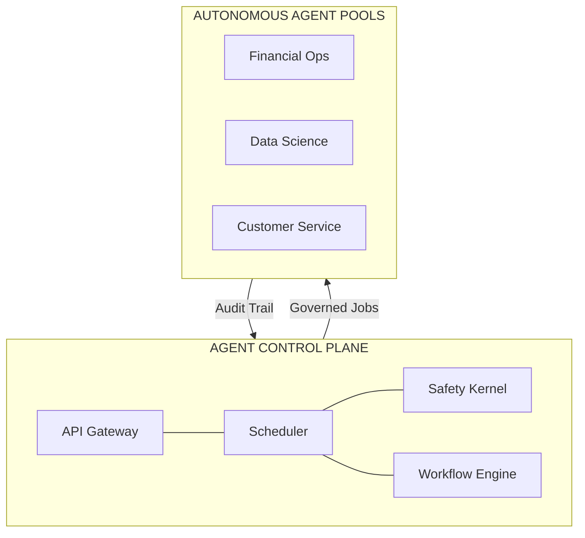
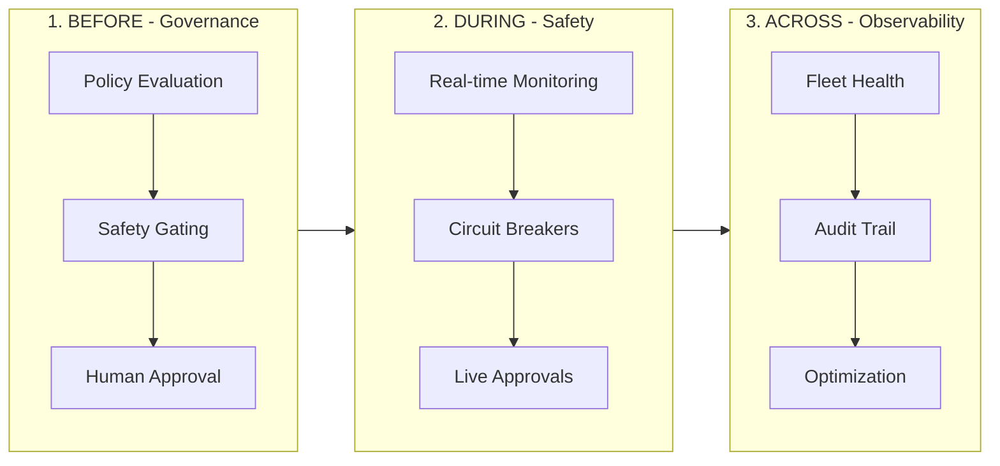

<p align="center">
  
</p>

<h1 align="center">Cordum</h1>

<p align="center">
  <a href="https://artifacthub.io/packages/helm/cordum/cordum"></a>
</p>

<p align="center">
  <strong>Know What Your AI Agents Are Doing. Before They Do It.</strong><br/>
  The Source-Available <strong>Agent Control Plane</strong> for Governance, Safety, and Trust.<br/>
  <em>Includes <strong>Cordum Edge</strong> — a Compliance Firewall for Claude Code and other local AI-agent actions.</em>
</p>

<p align="center">
  <a href="https://github.com/cordum-io/cordum/stargazers"></a>
  <a href="https://github.com/cordum-io/cordum/blob/main/LICENSE"></a>
  <a href="https://github.com/cordum-io/cordum/releases"></a>
  <a href="https://github.com/cordum-io/cordum/actions/workflows/ci.yml"></a>
  <a href="https://goreportcard.com/report/github.com/cordum-io/cordum"></a>
  <a href="https://discord.gg/nvHzPCcWWt"></a>
  <a href="https://github.com/cordum-io/cap"></a>
</p>

<p align="center">
  <a href="https://discord.gg/nvHzPCcWWt">Discord</a> · <a href="https://github.com/cordum-io/cordum/discussions">Discussions</a> · <a href="docs/">Docs</a>
</p>

---

## Quickstart

One command stands up the full stack — API gateway, scheduler, safety
kernel, workflow engine, context engine, dashboard, NATS, and
TLS-secured Redis — with auto-generated secrets, auto-provisioned
certificates, and a post-deploy smoke test that exercises a real
approval workflow:

```bash
git clone https://github.com/cordum-io/cordum.git
cd cordum
./tools/scripts/quickstart.sh
```

**Prerequisites:** Docker Desktop v4+ (or Engine v20.10+ with Compose v2,
≥ 4 GB RAM allocated), Go 1.24+ (for first-run cert generation), and
`curl`. On Windows use MSYS2 / Git Bash / WSL.

**What you get at the end:**
- Dashboard at http://localhost:8082 (admin / admin123).
- Gateway at http://localhost:8081 with a generated `CORDUM_API_KEY` in
  `.env`.
- TLS CA, server, and client keypairs under `./certs/`.
- A working approval-gate workflow proven by the built-in
  `platform_smoke.sh` run.

Full walkthrough, platform notes, and troubleshooting:
[docs/quickstart.md](docs/quickstart.md).

### See a 3-verdict demo

Once the stack is up, install the `demo-quickstart` pack and run the
governance demo:

```bash
cordumctl pack install ./demo/quickstart/pack
cordumctl demo run quickstart
```

A single `hello, operator!` workflow fans out to three topics and
exercises every safety-kernel decision class in under 30 seconds:

```
  +--------------------+--------------------------+--------------------+---------
  | Step               | Topic                    | Verdict            | Reason
  +--------------------+--------------------------+--------------------+---------
  | greet              | job.demo-quickstart.greet           | ALLOW              | Safe…
  | attempt_delete     | job.demo-quickstart.delete-all      | DENY               | Block…
  | escalate_admin     | job.demo-quickstart.admin           | REQUIRE_APPROVAL   | Sign…
  +--------------------+--------------------------+--------------------+---------
```

Full walkthrough, rule-by-rule explanation, and extension recipe:
[demo/quickstart/README.md](demo/quickstart/README.md).

### Edge Quickstart (Compliance Firewall for Claude Code)

Cordum Edge governs Claude Code tool calls in the developer's terminal — the
hook denies risky actions before they run, requires approval on edits, and
exports a redacted evidence bundle for every session. Once the platform stack
is up (above), point Claude Code at Cordum:

```bash
export CORDUM_GATEWAY=https://localhost:8081
export CORDUM_API_KEY=$(grep CORDUM_API_KEY .env | cut -d= -f2)
export CORDUM_TENANT_ID=default
./bin/cordumctl edge claude
```

The wrapper renders a temporary `settings.json`, spawns `cordum-agentd` on a
local loopback nonce, and starts Claude Code with the command hook installed.
Read .env is denied; Edit/Write requires approval; safe reads pass through
untouched. The dashboard shows the live session timeline at
[/edge/sessions](http://localhost:8082/edge/sessions).

For approved destructive actions, Edge does not trust the approval store alone:
the ProvenanceGate also requires a resolved approval audit event for the same
tenant, `approval_ref`, and `action_hash`. An approval-requested event by itself
does not satisfy provenance, and raw prompts, transcripts, and tool payloads are
kept out of audit evidence.

Full 30-minute walkthrough: [docs/quickstart-edge.md](docs/quickstart-edge.md).
Reference: [docs/edge/README.md](docs/edge/README.md).

---

## The Problem: The Agent Risk Gap

Enterprises are rushing to deploy **Autonomous AI Agents**, but they're hitting a wall of risk. According to Gartner, **74% of enterprises see AI agents as a new attack vector**, and over 40% of agentic AI projects will be canceled due to inadequate risk controls.

The current landscape leaves teams with a choice:
1. **Restrict agents** to simple, low-value read-only tasks.
2. **Accept the risk** of autonomous agents taking destructive, unmonitored actions.

Without a dedicated governance layer, you're flying blind:
- **No visibility**: You don't know what your agents are doing until *after* they do it.
- **No safety rails**: There's no way to intercept dangerous operations before they execute.
- **No human-in-the-loop**: Sensitive actions happen without manual oversight.
- **No audit trail**: When things go wrong, you can't reconstruct the chain of thought.

## The Solution: Cordum Agent Control Plane

Cordum is an **Agent Control Plane** that provides a deterministic governance layer for probabilistic AI minds. It allows you to define, enforce, and audit the behavior of your **Autonomous AI Agents** across any framework or model.



<!-- Replace with a high-impact GIF showing a risky agent action being caught by Cordum -->


### Governance Across the Lifecycle

Cordum's **Before/During/Across** framework provides exhaustive control over your agent operations:



- **BEFORE (Governance)**: Define declarative policies that evaluate job requests *before* an agent executes. Trigger safety kernel checks, throttle risky actions, or flag operations for human approval.
- **DURING (Safety)**: Real-time visibility into active agent runs. Monitor progress, handle step-level approvals, and enforce timeouts or circuit breakers on the fly.
- **ACROSS (Observability)**: Manage your entire fleet from a single control plane. Aggregate audit trails, track capability-based routing, and observe agent pool health in real-time.


### Cordum Edge: Compliance Firewall for AI agents

Cordum Edge extends the control plane to local AI-agent actions. For Claude Code,
`cordumctl edge claude` launches the real P0 path — command hook, local
`cordum-agentd`, Gateway Edge APIs, Safety Kernel policy/evaluate, approvals,
artifact pointers, and dashboard evidence.

Cordum stays quiet until governance matters. Developers see Cordum exactly when
it protects them, their team, and production: before risky tools run, when an
action needs approval, and when evidence must be exported. The wrapper is the
developer/demo path; enterprise enforcement requires managed Claude settings and
endpoint controls.

Approval provenance is resolved-only: destructive retries must have a matching
approved approval record and a canonical resolved approval audit event for the
same tenant/ref/hash. Requested-only audit rows are lifecycle context, not proof
that the action was approved.

Start here: [Edge overview](docs/edge.md), [Claude Code guide](docs/edge-claude-code.md),
[manual demo](docs/demo-edge-claude.md), and [Edge API](docs/edge/api.md).

## Quickstart

### First Time?

| Goal | Path |
|------|------|
| **Just want to try it?** | `./tools/scripts/quickstart.sh` — one-command install from source ([guide](docs/quickstart.md)) |
| **Run the full stack from pre-built images?** | `docker compose pull && docker compose up -d` (below) — once release images ship to ghcr.io |
| **Developing Cordum?** | See [Development](#development) |

### Prerequisites

- **Docker Desktop v4+** or **Docker Engine v20.10+** with the **Compose v2** plugin (≥ 4 GB RAM allocated to Docker).
- **jq** (recommended, for parsing API responses).

### Run the published images

```bash
git clone https://github.com/cordum-io/cordum.git
cd cordum
export CORDUM_API_KEY=$(openssl rand -hex 32)
export REDIS_PASSWORD=$(openssl rand -hex 16)
docker compose pull         # pulls every Cordum service from ghcr.io
docker compose up -d        # starts the stack — no source build needed
```

**Dashboard:** http://localhost:8082
**Login:** `admin` / `admin123` (change in `.env` → `CORDUM_ADMIN_PASSWORD`)

Pin a specific release by exporting `CORDUM_VERSION=1.2.3` before
`docker compose pull`. Defaults to `:latest`, which only moves on stable
release tags (pre-release suffixes such as `-rc.1` never promote
`:latest`).

### Verifying image signatures

Every release-tag image is signed with [cosign] keyless OIDC. Verify
before deploying to production:

```bash
cosign verify ghcr.io/cordum-io/cordum/api-gateway:1.2.3 \
  --certificate-oidc-issuer https://token.actions.githubusercontent.com \
  --certificate-identity-regexp 'https://github\.com/cordum-io/cordum/\.github/workflows/docker\.yml@refs/tags/v.*'
```

See [docs/deployment/images.md](docs/deployment/images.md) for the full
image catalogue, multi-arch pull instructions, and tag policy.

[cosign]: https://docs.sigstore.dev/cosign/overview/

<details>
<summary>Manual setup (without docker compose)</summary>

```bash
cp .env.example .env
# Edit .env: set CORDUM_API_KEY (or generate: openssl rand -hex 32)
export CORDUM_API_KEY="your-key-here"
go run ./cmd/cordumctl up
open http://localhost:8082
```
</details>

### Deploy to Kubernetes

```bash
helm install cordum oci://ghcr.io/cordum-io/cordum/charts/cordum \
  --namespace cordum --create-namespace \
  --set secrets.apiKey=$(openssl rand -hex 32) \
  --set redis.auth.password=$(openssl rand -hex 32) \
  --set ingress.enabled=true \
  --set ingress.className=nginx \
  --set ingress.api.host=api.cordum.example.com \
  --set ingress.dashboard.host=cordum.example.com
```

See [cordum-helm/](cordum-helm/) for the full Helm chart reference. Chart also available on [Artifact Hub](https://artifacthub.io/packages/helm/cordum/cordum).

**Container images** (multi-arch: linux/amd64 + linux/arm64):

| Image | GHCR | Docker Hub |
|-------|------|------------|
| `api-gateway` | [`ghcr.io/cordum-io/cordum/api-gateway`](https://github.com/cordum-io/cordum/pkgs/container/cordum%2Fapi-gateway) | [`cordum/api-gateway`](https://hub.docker.com/r/cordum/api-gateway) |
| `scheduler` | `ghcr.io/cordum-io/cordum/scheduler` | [`cordum/scheduler`](https://hub.docker.com/r/cordum/scheduler) |
| `safety-kernel` | `ghcr.io/cordum-io/cordum/safety-kernel` | [`cordum/safety-kernel`](https://hub.docker.com/r/cordum/safety-kernel) |
| `workflow-engine` | `ghcr.io/cordum-io/cordum/workflow-engine` | [`cordum/workflow-engine`](https://hub.docker.com/r/cordum/workflow-engine) |
| `context-engine` | `ghcr.io/cordum-io/cordum/context-engine` | [`cordum/context-engine`](https://hub.docker.com/r/cordum/context-engine) |
| `mcp` | `ghcr.io/cordum-io/cordum/mcp` | `cordum/mcp` |
| `dashboard` | `ghcr.io/cordum-io/cordum/dashboard` | [`cordum/dashboard`](https://hub.docker.com/r/cordum/dashboard) |


Full catalogue, tag policy, cosign verification recipe, and multi-arch
notes: [docs/deployment/images.md](docs/deployment/images.md).

### Ports

| Port | Service |
|------|---------|
| 8082 | Dashboard |
| 8081 | API Gateway (HTTPS) |
| 9080 | gRPC Gateway |
| 4222 | NATS |
| 6379 | Redis |
| 9092 | Gateway Metrics |
| 9093 | Workflow Engine Health |
| 50051 | Safety Kernel (gRPC) |
| 50400 | Context Engine (gRPC) |

> **Port conflicts?** If any port is already in use, either stop the conflicting service or override ports in your `.env` file before starting the stack.

### After Setup

```bash
# Submit a test job
curl -sS --cacert ./certs/ca/ca.crt \
  -X POST https://localhost:8081/api/v1/jobs \
  -H "X-API-Key: $CORDUM_API_KEY" -H "X-Tenant-ID: default" \
  -H "Content-Type: application/json" \
  -d '{"topic":"job.default","context":{"prompt":"hello"}}'

# Stop the stack
docker compose down

# View logs
docker compose logs -f api-gateway
```

### Troubleshooting

| Issue | Fix |
|-------|-----|
| Port already in use | `docker compose down` then retry, or check `lsof -i :8082` |
| Docker out of memory | Allocate at least 4 GB RAM to Docker Desktop |
| Can't login to dashboard | Default credentials: admin / admin123 |
| TLS/SSL cert errors | Remove `./certs/` and re-run — certs auto-regenerate |
| `openssl` not found | Not needed — quickstart.sh auto-generates keys without it |
| Go build fails | Requires Go 1.24+ — check with `go version` |
| Stale config after changes | `redis-cli DEL cfg:system:default` then restart |

For detailed troubleshooting, see [docs/troubleshooting.md](docs/troubleshooting.md).

## Development

The published-images path above pulls Cordum binaries from `ghcr.io`.
Contributors who need to rebuild from source use the development override
file:

```bash
make dev-up      # docker compose -f docker-compose.yml -f docker-compose.dev.yml up -d --build
make dev-logs    # tail compose logs
make dev-down    # docker compose down
```

`docker-compose.dev.yml` re-pins every Cordum service to a local
`cordum/<name>:dev` tag and forces the `build:` context, so source
changes are reflected on the next `--build`. Upstream images (NATS,
Redis) are untouched. See `Makefile` and `docker-compose.dev.yml` for
full details.

Other useful contributor commands:

| Command | Purpose |
|---|---|
| `make build` | Build every service binary into `bin/` (wraps `make proto` first). |
| `make build SERVICE=cordumctl` | Build a single service. |
| `make test` | Run the full Go test suite. |
| `make smoke` | Quick post-deploy smoke against a running stack. |

## Key Features


| Governance Feature | Why It Matters for Enterprise |
|--------------------|--------------------------------|
| **Safety Gating** | Prevents agents from executing destructive or unauthorized actions *before* they occur. |
| **Output Quarantine** | Automatically blocks PII leaks, secrets, or hallucinated results from reaching the client. |
| **Human-in-the-Loop** | Mandates human oversight for high-risk operations (e.g., financial transfers, prod access). |
| **Pool Segmentation** | Ensures sensitive data only reaches agents in trusted environments. |
| **Deterministic Audit** | Prove exactly *why* a decision was made with a full chain-of-thought audit trail. |
| **Governance Policies** | Declarative YAML-based rules that map enterprise risk to agent behavior. |
| **Policy Simulator** | Test your governance rules against historical data before rolling them out to production. |
| **Cordum Edge** | Compliance Firewall for local AI-agent actions (Claude Code today, more agents next): hook → local agentd → Gateway evaluate → resolved approval provenance → redacted evidence export. See [docs/edge/README.md](docs/edge/README.md). |

## Architecture

```
cordum/
├── cmd/                          # Service entrypoints + CLI
│   ├── cordum-api-gateway/       # API gateway (HTTP/WS + gRPC)
│   ├── cordum-scheduler/         # Scheduler + safety gating
│   ├── cordum-safety-kernel/     # Policy evaluation
│   ├── cordum-workflow-engine/   # Workflow orchestration
│   ├── cordum-context-engine/    # Optional context/memory service
│   └── cordumctl/                # CLI
├── core/                         # Core libraries
│   ├── controlplane/             # Gateway, scheduler, safety kernel
│   ├── context/                  # Context engine implementation
│   ├── infra/                    # Config, storage, bus, metrics
│   ├── protocol/                 # API protos + CAP aliases
│   └── workflow/                 # Workflow engine
├── dashboard/                    # React UI
├── sdk/                          # SDK + worker runtime
├── cordum-helm/                  # Helm chart
├── deploy/k8s/                   # Kubernetes manifests
└── docs/                         # Documentation
```

## Documentation

| Doc | Description |
|-----|-------------|
| [System Overview](docs/system_overview.md) | Architecture and data flow |
| [Core Reference](docs/CORE.md) | Deep technical details |
| [Docker Guide](docs/DOCKER.md) | Running with Compose |
| [Agent Protocol](docs/AGENT_PROTOCOL.md) | CAP bus + pointer semantics |
| [MCP Server](docs/mcp-server.md) | MCP stdio + HTTP/SSE integration |
| [Pack Format](docs/pack.md) | How to package agent capabilities |
| [Local E2E](docs/LOCAL_E2E.md) | Full local walkthrough |
| [Edge Quickstart](docs/quickstart-edge.md) | New-engineer 30-min path: clone → live stack → governed Claude session |
| [Edge Reference](docs/edge/README.md) | Cordum Edge product, API, CLI, demo, runbook |
| [Production Guide](docs/production.md) | TLS, HA, backups, incident runbooks |

## Protocol: CAP — The Open Standard for Agent Governance

Cordum implements [CAP (Cordum Agent Protocol)](https://github.com/cordum-io/cap), an open protocol specifically designed for distributed AI agent governance. CAP provides a unified interface for defining agent capabilities, submitting jobs, and enforcing safety policies across heterogeneous agent pools.

### CAP vs. MCP: Why You Need Both

While both are essential, they solve different parts of the agent stack:

| Protocol | Focus | Level | Responsibility |
|----------|-------|-------|----------------|
| **MCP** (Model Context Protocol) | **Tool Calling** | Local | How a model interacts with a tool. |
| **CAP** (Cordum Agent Protocol) | **Governance** | Network | How an agent is governed within an enterprise. |

- **MCP** is for *within* the agent — it defines how a model calls local tools.
- **CAP** is for *above* the agent — it defines the governance control plane for the entire agent fleet.

Use CAP for high-level orchestration and safety gating, and MCP inside your agents for fine-grained tool integration.

[Read the full deep dive: MCP vs CAP: Why Your AI Agents Need Both Protocols](https://dev.to/yaron_torgeman_104570d968/-mcp-vs-cap-why-your-ai-agents-need-both-protocols-3g4l)

## MCP Server

Cordum includes an MCP server framework with:

- **Standalone stdio mode** via `cmd/cordum-mcp` (for Claude Desktop/Code local integration)
- **Gateway HTTP/SSE mode** via `/mcp/message` and `/mcp/sse` (when `mcp.enabled=true`)

See [docs/mcp-server.md](docs/mcp-server.md) for setup, auth headers, and client configuration examples.

## SDK

The Go SDK makes it easy to build CAP-compatible workers:

```go
import (
    "log"

    "github.com/cordum/cordum/sdk/runtime"
)

type Input struct {
    Prompt string `json:"prompt"`
}

type Output struct {
    Summary string `json:"summary"`
}

func main() {
    agent := &runtime.Agent{Retries: 2}

    runtime.Register(agent, "job.summarize", func(ctx runtime.Context, input Input) (Output, error) {
        // Your agent logic here
        return Output{Summary: input.Prompt}, nil
    })

    if err := agent.Start(); err != nil {
        log.Fatal(err)
    }
    select {}
}
```

SDKs: **Go** (stable) | [**Python**](https://github.com/cordum-io/cap) | [**Node**](https://github.com/cordum-io/cap)

## Integration Packs

Extend Cordum with [30+ integration packs](https://github.com/cordum-io/cordum-packs) for Slack, GitHub, AWS, Jira, Terraform, Datadog, PagerDuty, and more. Each pack is a CAP-native worker with policy-gated workflows.

| Pack | Category | Description |
|------|----------|-------------|
| Slack | Communication | Approval notifications and agent alerts |
| GitHub | DevOps | Govern agent actions on repositories |
| AWS | Cloud | Policy-gated cloud operations |
| Kubernetes | DevOps | Governed incident remediation |
| Terraform | DevOps | Pre-apply governance for IaC |
| Datadog | Monitoring | Alert-triggered governed workflows |
| LangChain | AI Framework | Governance for LangChain tool calls |
| MCP Bridge | AI Framework | Gateway governance for MCP tools |

[Browse all integrations →](https://github.com/cordum-io/cordum-packs)

## Community

- **Discord:** [Join the conversation](https://discord.gg/nvHzPCcWWt)
- **GitHub Discussions:** [Ask questions](https://github.com/cordum-io/cordum/discussions)
- **Twitter/X:** [@Cordum_io](https://x.com/Cordum_io)
- **Email:** See [SECURITY.md](SECURITY.md) for contact details

## Enterprise

Cordum Enterprise features (shipped in core, unlocked by license entitlement):
- SSO/SAML/OIDC integration + SCIM provisioning
- Advanced RBAC with role hierarchy
- SIEM export (webhook, syslog, Datadog, CloudWatch)
- Legal hold + velocity rules + agent identity
- Priority support

See [`docs/enterprise.md`](docs/enterprise.md) for the full entitlement matrix.
The formerly separate `cordum-enterprise` repo was retired 2026-04-23.

## Governance

Cordum follows a transparent governance model with a protocol stability pledge, maintainer structure, and clear decision-making process. See [GOVERNANCE.md](GOVERNANCE.md) for details including:

- **Protocol Stability**: CAP v2 wire format frozen until February 2027
- **Security**: [SECURITY.md](SECURITY.md) for vulnerability reporting
- **Versioning**: Semantic versioning with deprecation policy

## Roadmap

See [ROADMAP.md](ROADMAP.md) for the full feature roadmap, completed milestones, and planned work.

## Changelog

See [CHANGELOG.md](CHANGELOG.md) for a detailed log of all changes by version.

## Compared To

| Feature | Cordum | Guardrails AI | NeMo Guardrails | Custom Middleware |
|---------|--------|--------------|-----------------|-------------------|
| Pre-execution policy engine | ✅ Safety Kernel | ❌ Post-generation | ⚠️ Dialog rails only | ⚠️ Manual |
| Human-in-the-loop approvals | ✅ Built-in | ❌ | ❌ | ⚠️ DIY |
| Multi-agent fleet governance | ✅ | ❌ Single model | ❌ Single model | ❌ |
| Deterministic audit trail | ✅ | ❌ | ❌ | ⚠️ Manual |
| Framework agnostic | ✅ Any via CAP | ❌ Python only | ❌ NVIDIA stack | ❌ |
| MCP governance | ✅ Bridge + Gateway | ❌ | ❌ | ❌ |
| Local agent-action firewall | ✅ Cordum Edge (Claude Code hook today) | ❌ | ❌ | ⚠️ DIY |

[See detailed comparisons →](docs/comparison.md)

## Contributing

We welcome contributions! See [CONTRIBUTING.md](CONTRIBUTING.md) for guidelines. Check out our [good first issues](https://github.com/cordum-io/cordum/labels/good%20first%20issue) to get started.

## License

Licensed under [Business Source License 1.1 (BUSL-1.1)](LICENSE).

- **Self-host and use internally**: Permitted
- **Modify and contribute back**: Permitted
- **Offer as a competing hosted service**: Not permitted
- **Change Date**: January 1, 2029 — automatically converts to Apache License 2.0

See [LICENSE](LICENSE) for full terms.

---

## Star History

<a href="https://star-history.com/#cordum-io/cordum&Date">
 <picture>
   <source media="(prefers-color-scheme: dark)" srcset="https://api.star-history.com/svg?repos=cordum-io/cordum&type=Date&theme=dark" />
   <source media="(prefers-color-scheme: light)" srcset="https://api.star-history.com/svg?repos=cordum-io/cordum&type=Date" />
   
 </picture>
</a>

---

<p align="center">
  <strong>Ready to govern your AI agents?</strong><br/>
  <a href="https://github.com/cordum-io/cap">CAP Protocol</a> · <a href="https://github.com/cordum-io/cordum-packs">Integrations</a> · <a href="https://discord.gg/nvHzPCcWWt">Discord</a>
</p>

<p align="center">
  If Cordum helps you deploy agents safely, <a href="https://github.com/cordum-io/cordum/stargazers">give it a ⭐</a>
</p>
