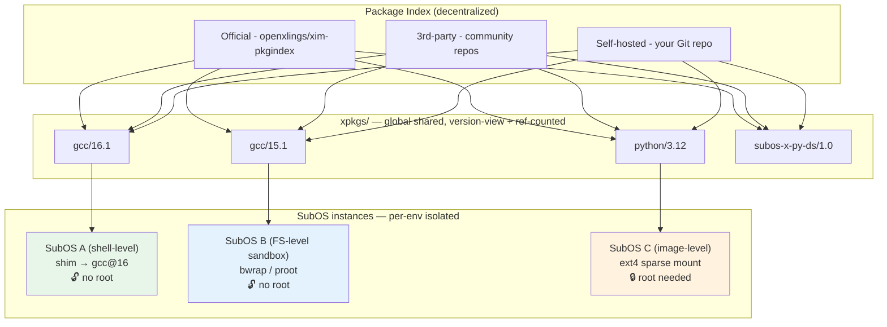
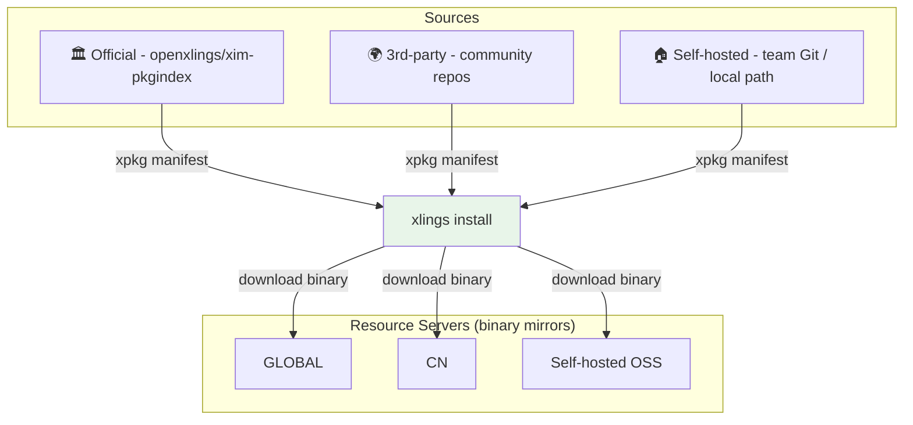

<div align=center>
  

  <h1>xlings</h1>

  <em>Universal package infrastructure with OS-like SubOS isolation.<br/>
  Multi-version · Rootless · Decentralized Index · Agent-ready.</em>

  <b> [Website] | [Docs] | [Package Index] | [Forum] </b>

  [中文](README.zh.md) | English
</div>

[Website]: https://openxlings.github.io/
[Docs]: docs/
[Package Index]: https://openxlings.github.io/xim-pkgindex
[Forum]: https://forum.d2learn.org/category/9/xlings

<p align=center>
  <em>Used by: <a href="https://github.com/mcpp-community/mcpp">MCPP</a> · upcoming <b>Luban</b> Linux</em>
</p>

<!-- TODO: 30s demo GIF here -->

---

## Why xlings?

| Pain | Without xlings | With xlings |
|------|----------------|-------------|
| Need gcc@16 alongside system gcc@11 | Manual builds, conflict-prone | `xlings install gcc@16` — both coexist |
| Team needs identical project env | "Works on my machine" | `.xlings.json` + `xlings install` — enter project dir and you're seamlessly in an isolated, reproducible SubOS |
| Agent needs its own isolated world to run in | Docker daemon + images + cleanup | Agent runs **inside** a SubOS — full permissions, rootless, lightweight, host untouched |

### vs. other tools

| | apt / brew | nix | docker | **xlings** |
|---|:---:|:---:|:---:|:---:|
| Multi-version coexistence | ❌ | ✅ | ✅ | ✅ |
| Rootless | ❌ | ⚠️ | ⚠️ | ✅ (except image mode) |
| No daemon | ✅ | ✅ | ❌ | ✅ |
| Cross-platform | ❌ | ⚠️ | ✅ | ✅ Linux / macOS / Windows |
| Isolation granularity | ❌ | FS | FS+ | 🔒 shell / FS / image (3 levels) |
| Storage reuse | — | ✅ store | ❌ image bloat | ✅ version-view + refcount |
| Startup overhead | ⚡ instant | ⚡ instant | 🐢 seconds | ⚡ instant / ~10ms (sandbox) |
| Decentralized index | ❌ | ❌ | ❌ | ✅ official + 3rd + self-hosted |
| Agent / JSON interface | ❌ | ❌ | ⚠️ API | ✅ `xlings interface` (NDJSON) |
| OS-level pkg mgr | apt is | NixOS | ❌ | ✅ (Luban Linux, upcoming) |

---

## Quick Start

### Install

**Linux / macOS**

```bash
curl -fsSL https://raw.githubusercontent.com/openxlings/xlings/main/tools/other/quick_install.sh | bash
```

**Windows (PowerShell)**

```powershell
irm https://raw.githubusercontent.com/openxlings/xlings/main/tools/other/quick_install.ps1 | iex
```

### Via your AI agent

Copy this prompt to your AI agent (Claude, Codex, OpenCode, etc.):

```
Install xlings package manager on my machine.
- Linux/macOS: curl -fsSL https://raw.githubusercontent.com/openxlings/xlings/main/tools/other/quick_install.sh | bash
- Windows: irm https://raw.githubusercontent.com/openxlings/xlings/main/tools/other/quick_install.ps1 | iex
Project: https://github.com/openxlings/xlings
```

### Hello, multi-version

```bash
xlings install gcc@16 node@24 cmake
xlings use gcc@16        # switch active version
gcc --version            # gcc 16.x
```

---

## Core Concepts



### Five pillars

1. **📦 Universal package infrastructure** — binary / script / config / subos / tutorial — all as xpkg
2. **🔀 Multi-version coexistence** — N versions side-by-side; version-view + reference-counting (N envs ≈ 1× storage)
3. **🏗️ 3-level SubOS isolation** — shell (env switch) / FS (bwrap/proot, rootless) / image (ext4, root)
4. **🌐 Decentralized package index** — official + 3rd-party + self-hosted; resource servers for binary mirrors
5. **🤖 JSON event interface** — `xlings interface` (NDJSON protocol) for AI agents, CI, and 3rd-party tooling

---

## Three Scenarios

### 🛠 Toolchain — multi-version without sudo

```bash
xlings install gcc@16 gcc@11 cmake node@24
xlings use gcc@16        # instant switch
xlings use gcc@11        # back to 11, no conflict
```

### 📦 Project — seamless project-level SubOS

When you enter a project directory containing `.xlings.json`, xlings **seamlessly activates a project-scoped SubOS** — you and your team work inside an isolated environment without even noticing. All dependencies stay within the project's own SubOS.

```json
{
  "workspace": {
    "xmake": "3.0.7",
    "gcc": { "linux": "16.1.0" },
    "llvm": { "macosx": "20.1.7" }
  }
}
```

```bash
cd my-project/           # automatically enters project SubOS
xlings install           # installs deps into project-local isolation
xmake build              # everything just works, isolated from host
```

Clone → `cd` → build. Same env across teammates and CI. No manual activation needed.

### 🤖 Agent — agent runs inside its own lightweight world

xlings lets you run agents (codex, claude, opencode, etc.) **inside SubOS** — the agent gets full permissions within its isolated world, while the host remains completely safe.

**Why this matters:**

- 🔓 Agent has broader permissions inside SubOS — install packages, modify files, run arbitrary code — no risk to host data
- 🔁 Same agent tool, multiple instances on one host — each in its own SubOS with its own config (normally codex/claude can only run once per account)
- ⚡ Lightweight — not a heavy VM or container, just a namespace-isolated environment

**Run an agent inside SubOS:**

```bash
# Create a SubOS for the agent (from a base env, or configure your own)
xlings subos new claude-workspace --from subos:dev-env@latest

# Enter SubOS — the agent runs IN here, with full control
xlings subos use claude-workspace --sandbox
# → you're now inside the agent's world
# → start claude / codex / opencode here
# → they can install, modify, experiment freely — host is untouched

# Multiple isolated instances of the same agent on one machine
xlings subos new claude-workspace-1 --from subos:dev-env@latest
xlings subos new claude-workspace-2 --from subos:dev-env@latest
xlings subos new codex-workspace --from subos:dev-env@latest
```

**One-shot tasks via `--cmd` also work:**

```bash
xlings subos use claude-workspace --sandbox --cmd "python analyze.py"
```

No root. No daemon. No image bloat. **Each agent gets its own world.**

---

## SubOS Deep Dive

### Three isolation levels

| Level | Mechanism | Root? | Isolation scope | Use case |
|-------|-----------|:---:|---|---|
| 🟢 **Shell** | env/PATH switch | No | Tool versions only | Daily dev, version pinning |
| 🔵 **FS** | bwrap / proot sandbox | No | Filesystem (HOME, /tmp private) | Agent, experiments, untrusted code |
| 🟠 **Image** | ext4 sparse mount | Yes | Full block-device isolation | Heavy workloads, persistent sandboxes |

### Key features

- **Fork from base** — `xlings subos new <name> --from <local|subos:pkg@ver>` (0s for shared storage)
- **Non-interactive exec** — `xlings subos use <name> --cmd "<command>"` (exit code propagates)
- **Sandbox mode** — `--sandbox` flag; bwrap preferred (setuid, xim-managed), proot fallback
- **Storage modes** — `--storage shared|tmpfs|image` chosen at fork time
- **Project-local SubOS** — add `"subos": "<name>"` to `.xlings.json`; entering the project directory seamlessly activates the project's SubOS
- **Keeper (opt-in)** — `--keep` holds mount namespace alive for high-frequency exec; `xlings subos stop` to release

---

## Package Index Ecosystem



Add a custom index in one line:

```json
{
  "index_repos": [
    { "name": "xim", "url": "https://github.com/openxlings/xim-pkgindex.git" },
    { "name": "my-team", "url": "git@gitlab.internal:devtools/pkgs.git" }
  ]
}
```

---

## Ecosystem

| Project | Role | Link |
|---------|------|------|
| **MCPP** | Modern C++ build toolchain ecosystem — distributed through xlings | [github.com/mcpp-community/mcpp](https://github.com/mcpp-community/mcpp) |
| **Luban Linux** | Upcoming Linux distribution using xlings as system-level package manager | *(link when published)* |
| **xim-pkgindex** | Official package index — 60+ packages and growing | [openxlings/xim-pkgindex](https://github.com/openxlings/xim-pkgindex) |

---

## Agent Integration

### The agent lives inside SubOS

Unlike traditional "agent calls tool" patterns, xlings puts the **agent itself inside a SubOS**. The agent gets a full isolated environment — it can install packages, write files, run services — all without touching the host.

| Use case | How |
|----------|-----|
| Give agent full permissions safely | Run agent inside `--sandbox` SubOS |
| Multiple instances of same agent (codex/claude) on one host | One SubOS per instance |
| Agent needs specific env (Python + CUDA + custom libs) | Fork from `subos:ml-env@latest` |
| Ephemeral task execution | `--storage tmpfs` + `--cmd` |

### Programmatic interface

`xlings interface` provides NDJSON protocol over stdio — for programmatic control by AI agents, CI systems, and third-party tools:

```bash
xlings interface
# → {"protocol":"1.0","capabilities":[...]}
# ← {"action":"install","target":"subos:py-ds@latest"}
# → {"kind":"progress","phase":"downloading","percent":45,...}
# → {"kind":"data","dataKind":"installed","payload":{...}}
```

### Dev & test environments

Beyond agents, SubOS is also great for development and testing:

```bash
# Different environments for different scenarios
xlings subos new rust-nightly --storage shared
xlings subos new legacy-gcc11 --storage shared

# Or use project-local mode: just cd into the project directory
cd my-project/           # seamlessly enters project SubOS
```

---

## Building from source

```bash
# 1. Install xlings (see Quick Start above)
# 2. From the repo root — install build deps:
xlings install           # reads .xlings.json → xmake, cmake, ninja, toolchain

# 3. Switch to the dev toolchain:
xlings use gcc@16.1.0    # ensures glibc-linked xrepo cache is used

# 4. Build:
xmake f -y && xmake build xlings
xmake build xlings_tests && xmake run xlings_tests
```

The same `.xlings.json` drives CI and the release pipeline.

---

## Community

- **Forum**: [forum.d2learn.org/category/9/xlings](https://forum.d2learn.org/category/9/xlings)
- **QQ Groups**: 167535744 / 1006282943
- **Issues**: [github.com/openxlings/xlings/issues](https://github.com/openxlings/xlings/issues)

### Contributing

- [Issue handling & bug fixing](https://xlings.d2learn.org/en/documents/community/contribute/issues.html)
- [Adding new packages](https://xlings.d2learn.org/en/documents/community/contribute/add-xpkg.html)
- [Documentation](https://xlings.d2learn.org/en/documents/community/contribute/documentation.html)

---

**Contributors**

<a href="https://github.com/openxlings/xlings/graphs/contributors">
  
</a>

[](https://star-history.com/#openxlings/xlings&openxlings/xim-pkgindex&Date)
