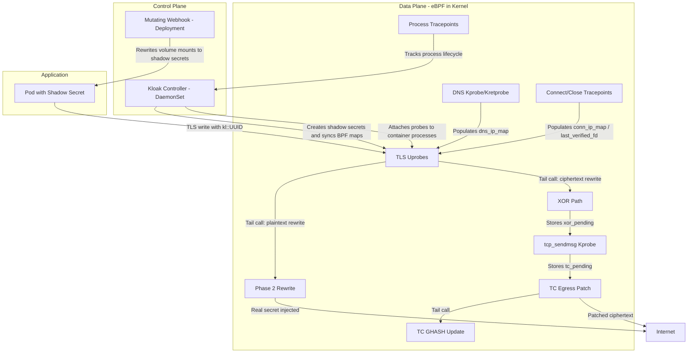
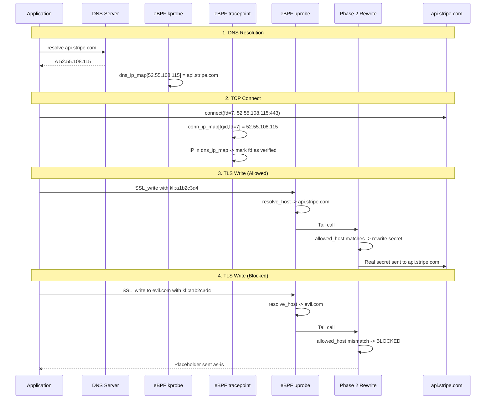

<div align="center">
  <a href="https://getkloak.io/"></a>
</div>

<h1 align="center"><a href="https://getkloak.io/">Kloak</a></h1>

<p align="center">
  <b>Secure Your Secrets, Agentless</b><br>
  Kubernetes eBPF HTTPS interceptor. Transparent secret injection without application changes or sidecars.
</p>

<div align="center">

[](https://github.com/spinningfactory/kloak/actions/workflows/ci.yml)
[](https://gist.github.com/dhiaayachi/2d4be46e60ee478d5703d8b009dbd6e9)
[](https://go.dev/)
[](https://kubernetes.io/)
[](LICENSE)

</div>

---

Kloak transparently intercepts outbound TLS traffic in Kubernetes using eBPF uprobes, replacing hashed placeholders with real secrets at the kernel level before encryption. Applications never handle actual credentials, and no sidecars or code changes are required.

## Features

- **No code changes** -- No SDK, no library, no application modifications. Mount a secret, make HTTPS requests, and Kloak handles the rest.
- **Secret isolation** -- Applications only see hashed shadow values (`kl::<UUID>`). Real secrets exist solely in eBPF maps and are injected in-kernel at TLS write time.
- **Zero overhead** -- eBPF uprobes operate in kernel space with negligible latency impact. No userspace proxy or sidecar in the data path.
- **Kubernetes native** -- Works with standard Kubernetes Secrets. Enable with a single label.
- **Host and IP filtering** -- Secrets annotated with `getkloak.io/hosts` are only sent to specific destination hostnames or IP addresses, preventing exfiltration to unauthorized servers.
- **Port-based filtering** -- Secrets annotated with `getkloak.io/port` are restricted to connections on a specific destination port.
- **Broad runtime support** -- Hooks into OpenSSL, BoringSSL, and Go's native `crypto/tls`. Works with Python, Node.js, Go, Rust, Ruby, PHP, curl, and any OpenSSL-linked runtime.

## Quick Start

### Prerequisites

- Kubernetes cluster (1.28+) with Linux kernel 5.17+
- [Helm](https://helm.sh/docs/intro/install/) 3.12+
- `kubectl` configured with cluster access

### Install with Helm

```bash
helm repo add kloak https://chart.getkloak.io
helm repo update

helm install kloak kloak/kloak -n kloak-system --create-namespace

kubectl get pods -n kloak-system
```

### Labels and Annotations

| Key | Type | Scope | Description |
|-----|------|-------|-------------|
| `getkloak.io/enabled=true` | Label | Secret, Namespace, Pod | Enables Kloak for the target resource. On namespaces and pods, controls webhook scope. On secrets, triggers shadow secret creation. |
| `getkloak.io/hosts=host` | Annotation | Secret | Restricts which destination host or IP address a secret can be sent to (single value only) |
| `getkloak.io/port=443` | Annotation | Secret | Restricts which destination port a secret can be sent to |
| `getkloak.io/managed=true` | Label | Secret | Marks shadow secrets created by Kloak (do not set manually) |

### Try the Demo

```bash
# Full demo: creates a Lima VM with K3s, deploys Kloak and sample apps
./examples/setup-demo.sh

export KUBECONFIG=/tmp/kloak-k3s.yaml

# View logs (should show real secrets in httpbin.org responses)
kubectl logs -f -l app=demo-python -n kloak-demo -c demo-app

# Cleanup
./examples/destroy-demo.sh
```

## Architecture

Kloak consists of a control plane (controller + webhook) and an eBPF data plane that runs entirely in kernel space.



### Components

| Component | Description |
|-----------|-------------|
| **Controller** (DaemonSet) | Watches Secrets labeled `getkloak.io/enabled=true`, creates shadow secrets with length-matched `kl::<UUID>` placeholders, syncs real values into eBPF maps, and attaches TLS uprobes to container processes via cgroup discovery. |
| **Webhook** (Deployment) | Mutating admission webhook that intercepts Pod creation. Rewrites Secret volume mounts to point to shadow secrets. Evaluates enablement through pod labels or namespace labels. Rejects pods if the shadow secret has not been created yet (fail-closed). Two webhook entries ensure only kloak-enabled namespaces and pods are affected; non-kloak workloads are never impacted, even when the webhook is down. |
| **TLS Uprobes** | Attach to `SSL_write` / `SSL_write_ex` (OpenSSL/BoringSSL) and `crypto/tls.(*Conn).Write` (Go native). Intercept outbound TLS writes, scan for `kl::` prefixes. Two rewrite paths: Phase 2 for plaintext rewrite (before encryption), and XOR path for ciphertext patching (after encryption). |
| **XOR Path + TC Egress** | For Go native TLS: computes XOR diff in the uprobe, bridges through `tcp_sendmsg` kprobe to TC egress, which patches the encrypted packet in-flight and recomputes the GHASH authentication tag via a tail call to `tc_ghash_update`. |
| **DNS Kprobe** | Kprobe/kretprobe on `udp_recvmsg` captures DNS responses system-wide. Parses A/AAAA records for watched hostnames and populates `dns_ip_map` (IP to hostname) with TTL tracking. |
| **Connect/Close Tracepoints** | Hooks `sys_enter/exit_connect` to track TCP connections (fd to destination IP in `conn_ip_map`). When the destination matches a DNS-verified hostname, caches the fd in `last_verified_fd`. Hooks `sys_enter_close` to clean up stale entries. |
| **Process Tracepoints** | Hooks `sched_process_exec` and `sched_process_exit` to track container process lifecycle for uprobe attachment and cleanup. |

### Supported Runtimes

| Runtime | TLS Library | Hook Point |
|---------|------------|------------|
| Python, Rust, Ruby, PHP, curl | OpenSSL (libssl.so) | `SSL_write` / `SSL_write_ex` uprobe |
| Node.js | BoringSSL (statically linked) | `SSL_write` uprobe |
| Go | crypto/tls (native) | `crypto/tls.(*Conn).Write` uprobe |

## DNS-Verified Trust Chain

Secrets with `getkloak.io/hosts` annotations are only rewritten when the destination is verified through the full DNS resolution chain. This prevents secret exfiltration to unauthorized servers, even if an application is compromised.



### How Host Verification Works

1. **DNS capture** -- A kprobe on `udp_recvmsg` intercepts DNS responses on the node. For hostnames listed in `getkloak.io/hosts`, resolved IPs are stored in `dns_ip_map` with TTL tracking.

2. **Connection tracking** -- Tracepoints on `sys_enter/exit_connect` record each TCP connection's fd-to-destination-IP mapping in `conn_ip_map`. If the destination IP exists in `dns_ip_map`, the fd is marked as verified.

3. **Host resolution** -- At `SSL_write` time, `resolve_host()` chains through verified fd, `conn_ip_map`, and `dns_ip_map` to determine the hostname of the current TLS connection.

4. **Secret filtering** -- Phase 2 compares the resolved hostname against the secret's `allowed_host`. Match: rewrite. Mismatch: placeholder sent as-is, keeping the secret safe.

5. **TTL enforcement** -- DNS entries include a TTL. Expired entries are skipped on lookup, requiring re-verification through fresh DNS responses.

## How It Works

### 1. Label and Annotate Your Secrets

Add `getkloak.io/enabled=true` as a label to enable Kloak. Use annotations for host and port filtering. Kloak generates a shadow secret with `kl::<UUID>` placeholders that are length-matched to the original values.

```yaml
apiVersion: v1
kind: Secret
metadata:
  name: api-credentials
  labels:
    getkloak.io/enabled: "true"
  annotations:
    getkloak.io/hosts: "api.stripe.com"
    getkloak.io/port: "443"
data:
  api-key: c2stbGl2ZS14eXoxMjM=  # sk-live-xyz123
```

### 2. Deploy Your Application

The webhook automatically rewrites volume mounts to use the shadow secret. Your application sees only `kl::<UUID>` placeholders and never handles real credentials.

```
# What the application reads from the mounted secret:
kl::a1b2c3d4-e5f6-7890
```

### 3. Automatic In-Kernel Rewrite

When the application makes an outbound HTTPS request, the eBPF uprobe intercepts the TLS write, verifies the destination through the DNS trust chain, and replaces the placeholder with the real secret before encryption.

```
# What the application writes:
Authorization: Bearer kl::a1b2c3d4-e5f6-7890

# What leaves the node (after eBPF rewrite):
Authorization: Bearer sk-live-xyz123
```

## Development

```bash
make build          # Build the kloak binary
make test           # Run all tests
make docker-build   # Build Docker image
```

eBPF development requires Linux. On macOS, Kloak uses Lima VMs:

```bash
make lima-start      # Start Lima VM
make generate-ebpf   # Generate eBPF Go bindings
make test-linux      # Run tests in Linux VM
make lima-shell      # Shell into VM
```

## License

AGPL-3.0
